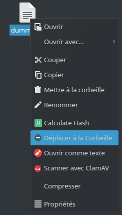
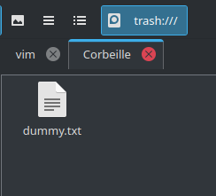
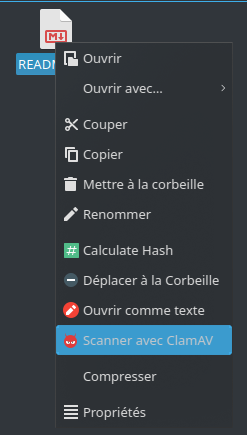
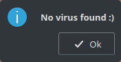

# My PCManFM-Qt custom actions

## Move to trash
I have been a `dolphin` file manager user for a long time now, but with my
switch to standalone WM/Compositor, I also made the switch to light weight
`PCManFM-Qt` FM, because I kinda like my cute (Qt) apps.

The issue now is that the `trash` doesn't work on my other (`NTFS`) partitions,
And I tried many other FMs (`nemo`, `caja`, `thunar` ...) and none of them worked
except `dolphin` and `nautilus` because I didn't tried it.

Comes custom actions to the rescue with the help of [`trashy`](https://github.com/oberblastmeister/trashy) a `Rust`-based
cli tool with FreeDesktop Trash specification support.

[ desktop file ](actions/move-to-trash.desktop)





---
## Scan with [ ClamAV ](https://www.clamav.net/)
I download a lot of files (Videos, music, executables...), and share them with my family, so sometimes I get a little worried if I downloaded some infected files, and with the [`ClamTk`](https://gitlab.com/dave_m/clamtk/-/issues/144) project put to 'rest' by the developer, I need a way to quickly scan some files without the need to open a terminal and the run the scan command.
Hince this custom action that makes use of `ClamAV` antivirus to run some tests.

Aside from the `ClamAV` dependency, this action needs `kdialog`
or `notify-send` to be installed to show messages.

[ desktop file ](actions/scan-with-clamscan.desktop)

[ script ](scripts/scan-clamav.sh)





___
## Installation

1. Make the custom actions directory in `$HOME/.local/share` if it dosn't exist
```
mkdir -p ~/.local/share/file-manager/actions
```
2. Copy the desired actions to that directory
```
cp ./actions/* ~/.local/share/file-manager/actions
```
3. Copy the corresponding script to the `$PATH`
```
cp scripts/* ~/.local/bin
```
